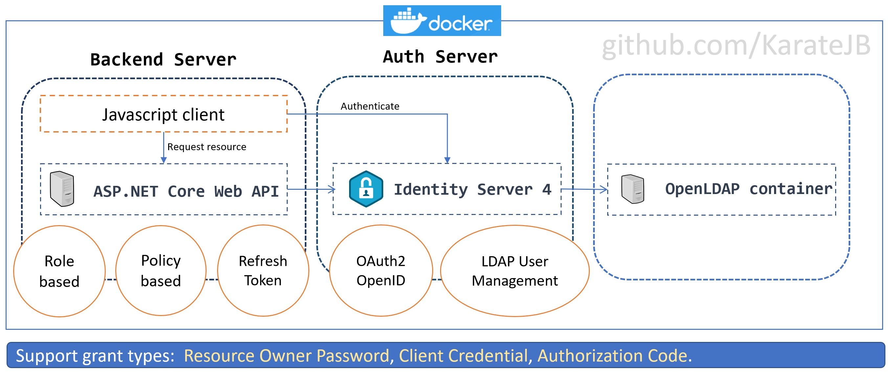

[](https://opensource.org/licenses/BSD-3-Clause)


# Features



## Supported Grant types

- Resource Owner Password
- Client Credential
- Authorization Code (PKCE)
  - MVC Cookie based
  - JS client

## Supported Deploy methodology 

- Docker Compose
- Kubernetes


# Tutorials

- [[OpenLDAP] Create an OpenLDAP container](https://karatejb.blogspot.com/2019/07/openldap-create-openldap-container.html)
- [[ASP.NET Core] Identity Server 4 - Concepts](https://karatejb.blogspot.com/2019/11/aspnet-core-identity-server-4-concepts.html)
- [[ASP.NET Core] Identity Server 4 – LDAP authentication](https://karatejb.blogspot.com/2019/07/aspnet-core-identity-server-4-ldap.html)
- [[ASP.NET Core] Identity Server 4 – Secure WebAPI](https://karatejb.blogspot.com/2019/07/aspnet-core-identity-server-4-secure.html)
- [[ASP.NET Core] Identity Server 4 – Custom EventSink](https://karatejb.blogspot.com/2019/07/aspnet-core-identity-server-4-secure.html)
- [[ASP.NET Core] Identity Server 4 – Refresh Token](https://karatejb.blogspot.com/2019/09/aspnet-core-identity-server-4-refresh.html)
- [[ASP.NET Core] Identity Server 4 – Role based authorization](https://karatejb.blogspot.com/2019/10/aspnet-core-identity-server-4-role.html)
- [[ASP.NET Core] Identity Server 4 – Policy based authorization](https://karatejb.blogspot.com/2019/10/aspnet-core-identity-server-4-policy.html)
- [[ASP.NET Core] Identity Server 4 – Dockerize](https://karatejb.blogspot.com/2019/11/aspnet-core-identity-server-4-dockerize.html)
- [[ASP.NET Core] Identity Server 4 – Client Credential](https://karatejb.blogspot.com/2019/11/aspnet-core-identity-server-4-client.html)
- [[ASP.NET Core] Identity Server 4 – Policy based authorization with custom Authorization handler](https://karatejb.blogspot.com/2020/02/aspnet-core-identity-server-4-policy.html)
- [[ASP.NET Core] Identity Server 4 – Signing credential](https://karatejb.blogspot.com/2020/04/aspnet-core-identity-server-4-signing.html)
- [[ASP.NET Core] Identity Server 4 – Authenticate by multiple LDAP](https://karatejb.blogspot.com/2020/05/aspnet-core-identity-server-4.html)
- [[ASP.NET Core] Identity Server 4 – Cache and refresh Discovery document](https://karatejb.blogspot.com/2020/08/Idsrv-cache-refresh-discovery-doc.html)
- [[ASP.NET Core] Identity Server 4 – PKCE Authorization Code flow](https://karatejb.blogspot.com/2021/01/aspnet-core-identity-server-4-pkce.html)
- [[ASP.NET Core] Identity Server 4 – Get authorized user claims](https://karatejb.blogspot.com/2021/01/idsrv-get-user-claims.html)
- [[ASP.NET Core] Identity Server 4 – PKCE Authorization Code Flow (Javascript client)](https://karatejb.blogspot.com/2021/04/code-flow-js-client.html)


# Open API document

> After start the Identity Server, you can find the Open API document on
> 
> [https://localhost:6001/swagger](https://localhost:6001/swagger)


## LDAP User Management

| Route | Http method | Description |
|:------|:-----------:|:------------|
| /api/LdapUser            | POST   | Create a LDAP User  |
| /api/LdapUser            | PUT    | Update a LDAP User |
| /api/LdapUser/ResetPwd   | PUT    | Reset password |
| /api/LdapUser/{userName} | DELETE | Remove a LDAP user |


# Get started

## (Optional) Update appsettings.json file

Update the following config to connect to your own OpenOLAP service.

```json
"LdapServer": {
    "Url": "localhost",
    "Port": 389,
    "Ssl": false,
    "BindDn": "cn=admin,dc=example,dc=org",
    "BindCredentials": "admin",
    "SearchBase": "dc=example,dc=org",
    "searchFilter": "(&(objectClass=person)(uid={0}))"
  }
```

> To support authentication by multiple LDAP, use the configuration of `appsettings.MultiLdap.json`


## Restore packages

```s
$ cd src
$ dotnet restore
```


## (Optional) Use Gulp to Run multple applications in the same time

You can use gulp to run Auth Serice and API Service in the same time 

1. Install package globally 

```s
$ npm install -g gulp
$ npm install -g gulp-exec
```

2. Create npm link locally

```s
$ npm link gulp
$ npm link gulp-exec
```

3. Run applications

```s
$ gulp run
```

or run Auth Service(`auth`) or API Service(`webapi`) individually.

```s
$ gulp run auth
$ gulp run webapi
```

# Run on docker

## Method 1. Build Docker images and start containers on local Docker host

```s
$ cd docker
$ docker-compose build [--no-cache]
$ docker-compose up -d
```


## Method 2. Build Docker images and start containers on ubuntu

Use Ansible playbook to install Docker and deploy, see [the sample playbook here](https://github.com/KarateJB/JB.Ansible/tree/master/Deploy/AspNetCore.IdentityServer4.Sample)


# Run on Kubernetes 

> It's under construction and not stable.


## 1. Refine the internal IP of files in kubernets/artifects/


## 2. Execute commands

```s
$ cd kubernetes
$ kubectl apply -f kubernetes-namespace.yaml
$ kubectl create secret generic secret-appsettings-auth --from-file=./artifects/auth/appsettings.Kubernetes.json --namespace idsrv-demo
$ kubectl create secret generic secret-appsettings-backend --from-file=./artifects/backend/appsettings.Kubernetes.json --namespace idsrv-demo
$ kubectl create secret generic secret-js-appconfig-backend --from-file=./artifects/backend/app-config.js --namespace idsrv-demo
$ kubectl apply -f kubernetets-idsrv-deployments.yml --namespace idsrv-demo
```


# Appedix

## Create certificate by OpenSSL

```s
$ openssl req -newkey rsa:4096 -nodes -sha256 -keyout certs/Docker.key -x509 -days 3650 -out certs/Docker.crt
$ openssl pkcs12 -export -out certs/Docker.pfx -inkey certs/Docker.key -in certs/Docker.crt
```

## How to trust Self-signed certificate in Linux container

```s
$ apt-get install ca-certificates

$ CERT=Docker.crt
$ cp /etc/docker/$CERT /usr/share/ca-certificates
```

Then include the certificate,

```s
$ dpkg-reconfigure ca-certificates
```

Choose `3. ask` options and select the Self-signed certificate.


Finally, 

```s
$ CERT=Docker.crt
$ echo "+$CERT" >/etc/ca-certificates/update.d/activate_my_cert
$ cp /etc/docker/$CERT /usr/local/share/ca-certificates/
$ update-ca-certificates
```


# Reference

- [OpenLDAP – How To Add a User](https://tylersguides.com/guides/openldap-how-to-add-a-user/)
- [OpenLdap: How to create users in command line?](https://github.com/osixia/docker-openldap/issues/227#issuecomment-431375243)
